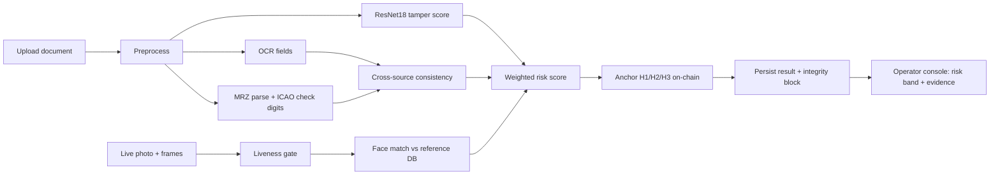

<div align="center">

# 🛡️ PramaanX

### *An AI-based fake identity-document screening system with a blockchain-anchored audit trail*

<p>
  <b>Read &nbsp;•&nbsp; Validate &nbsp;•&nbsp; Detect &nbsp;•&nbsp; Match &nbsp;•&nbsp; Anchor</b>
</p>

<p>
  <a href="#-key-features">Features</a> &nbsp;·&nbsp;
  <a href="#️-technology-stack">Stack</a> &nbsp;·&nbsp;
  <a href="#-application-flow">Flow</a> &nbsp;·&nbsp;
  <a href="#-run-locally">Run Locally</a> &nbsp;·&nbsp;
  <a href="#-key-api-endpoints">API</a> &nbsp;·&nbsp;
  <a href="#-security-summary">Security</a>
</p>


</div>

---

> **PramaanX** screens identity documents (passports and ID cards) for forgery. It reads
> the printed fields with OCR, validates the machine-readable zone (MRZ) against ICAO
> check digits, runs a deep-learning tamper detector, cross-checks the visible fields
> against the MRZ, and matches the document photo against a reference database with a
> liveness gate. Every verification is anchored to an append-only, three-checkpoint
> hash chain on-chain — so a result can be re-verified later and any change is provable,
> **without ever putting personal data on the blockchain**.

---

## ✨ Key Features

### 🧠 AI document screening
- 🔤 **OCR field extraction** — reads passport number, dates, and nationality with EasyOCR
- 🛂 **MRZ validation** — parses ICAO TD3 lines and verifies every check digit
- 🕵️ **Tamper detection** — a fine-tuned ResNet18 classifier scores forgery probability from pixel evidence
- 🔁 **Cross-source consistency** — visible (OCR) fields are checked against the MRZ; a forged printed field that no longer matches surfaces as a mismatch
- 📊 **Weighted risk scoring** — combines every signal into a `low` / `medium` / `high` risk band with a transparent per-component breakdown

### 👤 Biometric verification
- 🧑‍💼 **Face match** — InsightFace (`buffalo_l`) compares the document photo to a reference record
- 👁️ **Liveness check** — multi-frame motion gate before a face match is trusted
- 🎯 **Calibrated threshold** — safe `0.45` baseline, re-calibrated only when both same-person and different-person scores are available

### 🔗 Blockchain integrity
- ⛓️ **Three-checkpoint chain** — INPUT (H1) → ANALYSIS (H2) → FINAL (H3), each hash folding the previous one
- 🔒 **No PII on-chain** — only SHA-256 hashes and non-sensitive metadata are ever written
- 🔁 **Re-verifiable** — a stored `verification_id` lets you recompute and confirm the chain is `INTACT` after the fact

### 🖥️ Operator console
- 📈 **Dashboard** — live screening metrics
- 🔍 **Verify & Screening** — upload a document, watch the pipeline, read the evidence
- 🗂️ **History & Alerts** — searchable verification log and open-alert queue

---

## 🛠️ Technology Stack

| **Layer** | **Technology** |
|-----------|----------------|
| Backend API | Python 3.10+, Flask (canonical service, port 5001), FastAPI (AI pipeline app) |
| AI / ML | PyTorch (ResNet18), TorchVision, EasyOCR, OpenCV, InsightFace, NumPy, Pillow |
| Blockchain | Solidity ^0.8.19, Hardhat, web3.py, local EVM |
| Database | MongoDB Atlas with an offline local-JSON fallback |
| Frontend | React 18, Vite |

---

## 🧰 Skills & Tools

<div align="center">


</div>

---

## 🧭 Application Flow



1. **Upload** — an operator submits a document image (optionally a live photo + frames).
2. **AI pipeline** — OCR, MRZ validation, and the tamper classifier run on the image.
3. **Consistency** — visible OCR fields are cross-checked against the MRZ zone.
4. **Biometrics** — a liveness gate precedes the face match against the reference record.
5. **Risk** — every signal is combined into a weighted `low` / `medium` / `high` score.
6. **Anchor** — INPUT → ANALYSIS → FINAL hashes are written to the integrity chain.
7. **Review** — the console shows the risk band, per-signal evidence, and integrity status.

---

## 🖥️ Application Pages

| **Page** | **Purpose** |
|----------|-------------|
| Dashboard | Live screening metrics and recent activity |
| Verify | Single-document verification with the live pipeline view |
| Screening | Full document-screening flow with evidence cards |
| History | Searchable log of past verifications |
| Alerts | Open-alert queue with resolve actions |

---

## 🚀 Run Locally

### Prerequisites
- Python 3.10+
- Node.js 18+ (for the React console)
- (Optional) Node.js + npm for the local blockchain node
- (Optional) MongoDB Atlas connection string — a local JSON store works without it

### 1. Backend + frontend (core demo)

```powershell
python -m venv .venv
.\.venv\Scripts\Activate.ps1
pip install -r server\requirements.txt

Push-Location frontend
npm install
npm run build
Pop-Location

$env:P4_DATABASE_MODE = "local"   # offline JSON store; omit to use Atlas
python -m server.app
```

Open the operator console at **http://127.0.0.1:5001/**.
For frontend-only development, run `npm run dev` in `frontend` (Vite proxies API calls to Flask).

### 2. Enable the real AI pipeline (OCR + MRZ + tamper model)

```powershell
pip install -r ai_pipeline\requirements.txt      # easyocr, torch, torchvision, ...
python -m ai_pipeline.ai.ml.build_dataset         # synthesize a labelled dataset
python -m ai_pipeline.ai.ml.train                 # train tampering_model.pth

$env:P4_DOCUMENT_PIPELINE_MODULE = "ai_pipeline.ai.pipeline"
python -m server.app
```

Without this, the service uses a safe demo pipeline and honestly reports
`not_available` for AI checks rather than fabricating a result.

### 3. Enable on-chain anchoring (optional)

```powershell
cd blockchain
npm install
npx hardhat node                                  # Terminal A: local EVM
npx hardhat run scripts/deploy.js --network localhost   # Terminal B: deploy
```

Then start the service with `$env:BLOCKCHAIN_MODE = "real"`. When unset, an
in-process mock chain is used so the flow still works end-to-end.

### 4. (Optional) protect the API

Set `$env:P4_API_KEY = "<secret>"` — every `/api/*` call (except health checks)
then requires a matching `X-API-Key` header. Unset leaves the API open, which is
only appropriate for a trusted localhost demo.

### Tests

```powershell
python -m pytest -q
cd blockchain; python test_blockchain.py
```

---

## 📁 Project Structure

```
PramaanX/
├── server/                 # Flask canonical backend (port 5001)
│   ├── app.py              #   application factory + opt-in API-key gate
│   ├── config.py           #   env-driven settings
│   ├── routes/             #   verify, screening, integrity, health, ...
│   ├── services/           #   document_screening, face_match, liveness,
│   │                       #   mongo_store, integrity_chain, final_service
│   └── demo_data/          #   reference records for the local demo
├── ai_pipeline/            # Real AI modules + FastAPI app
│   └── ai/
│       ├── ocr.py          #   EasyOCR field extraction
│       ├── mrz.py          #   TD3 MRZ parsing + ICAO check digits
│       ├── tampering.py    #   ResNet18 tamper classifier
│       ├── pipeline.py     #   orchestrator -> {ocr, mrz, tampering}
│       └── ml/             #   build_dataset.py, train.py, model weights
├── blockchain/             # Solidity PramaanXRegistry + Hardhat + web3 service
│   ├── contracts/          #   contract.sol (append-only hash chain)
│   ├── scripts/deploy.js
│   └── blockchain_service.py
├── frontend/               # React 18 + Vite operator console
│   └── src/{pages,components,services}
├── demo_artifacts/         # Synthetic test documents (NOT real identities)
└── P2_PramaanX/            # Input-layer blockchain integrity
```

---

## 🔌 Key API Endpoints

| **Method & Path** | **Purpose** |
|-------------------|-------------|
| `POST /api/v1/verify` | Screen a document; returns evidence, risk, and the integrity block |
| `POST /api/v1/integrity/verify-all` | Recompute and confirm the H1/H2/H3 chain for a `verification_id` |
| `GET /api/v1/dashboard` | Screening metrics |
| `GET /api/v1/history` | Verification log (searchable) |
| `GET /api/v1/alerts` | Open alerts |
| `GET /api/v1/health` | Service + database health (always open) |

---

## 🔐 Security Summary

| **Protection** | **Purpose** |
|----------------|-------------|
| No PII on-chain | Only SHA-256 hashes and non-sensitive metadata are anchored; images, biometrics, and document numbers never leave secure storage |
| Server-side hashing | Integrity hashes are computed on the backend; a client-supplied hash is never trusted |
| Opt-in API key | `P4_API_KEY` + `X-API-Key` gate on `/api/*`, with constant-time comparison |
| Secrets excluded from git | `.env`, deployed addresses, and the Atlas URI are git-ignored — never commit a private key or connection string |
| Honest failure modes | When a model is unavailable the API reports `not_available` instead of fabricating an AI result |

---

## ⚠️ Notes & Limitations

- This is a **prototype**. The tamper detector is trained on a **procedurally
  generated synthetic dataset** (no real labelled corpus ships), so it is
  demo-grade — retrain on a real, labelled document corpus before production use.
- The unauthenticated mode is for **trusted localhost demos only**. Enable
  `P4_API_KEY` and put the service behind TLS before any non-local exposure.
- All bundled documents in `demo_artifacts/` are **synthetic** and are not real
  identity documents.

---

<div align="center">

### 🛡️ Built to make identity-document fraud provable, explainable, and auditable.

<sub>OCR · MRZ · Deep-learning tamper detection · Biometric match · Blockchain integrity chain</sub>

<br/>

⭐ *If this project helped you, consider starring the repo.*

</div>


